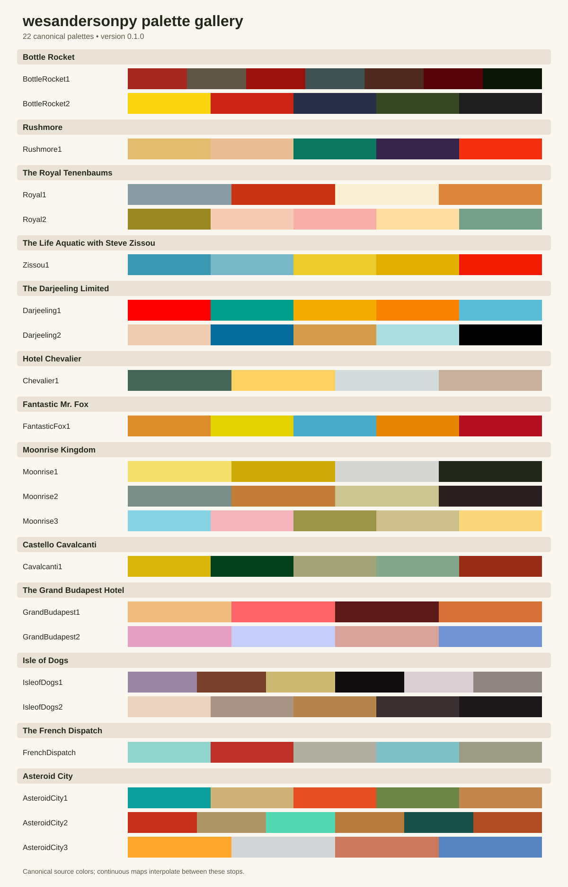
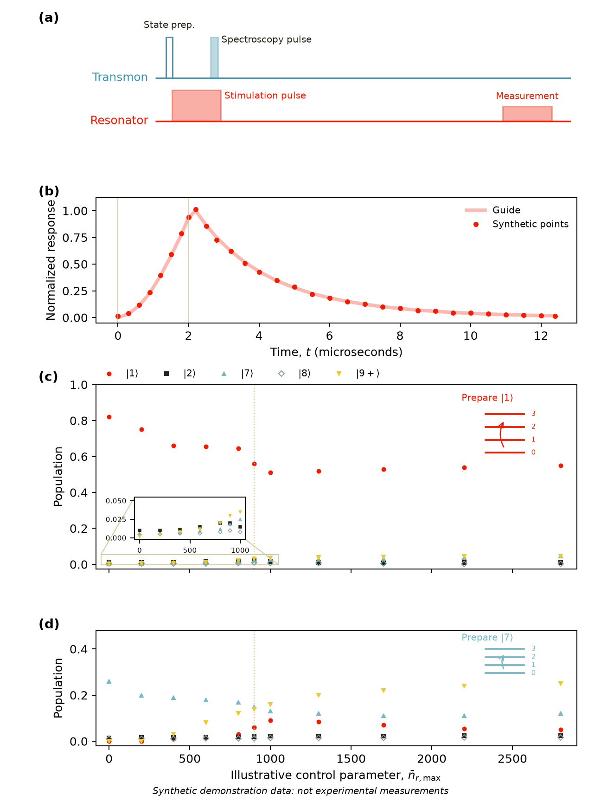
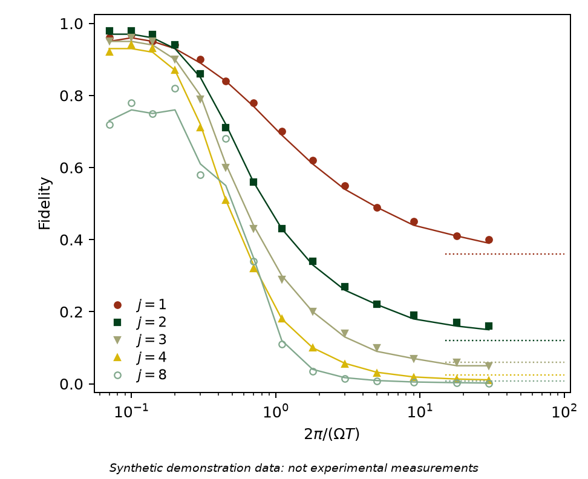
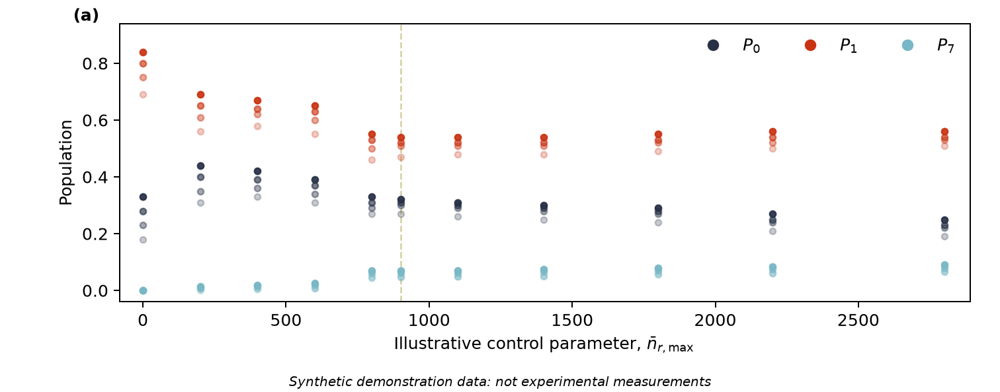
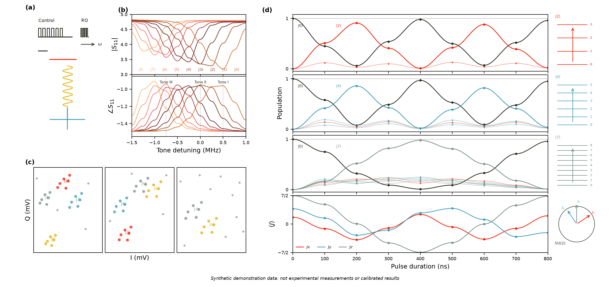
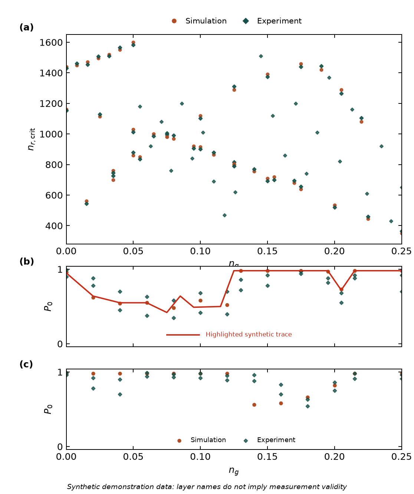

# wesandersonpy

Wes Anderson-inspired color palettes for Python, with a small typed API and first-class [Matplotlib](https://matplotlib.org/) colormaps.

`wesandersonpy` is an independent Python port inspired by Karthik Ram's [`wesanderson`](https://github.com/karthik/wesanderson) R package. It preserves the canonical palette names, source order, and hexadecimal color sequences while adding explicit Matplotlib integration. Version `0.1.0` is being prepared for its first release and is not yet published.

> **Accessibility:** These are artistic palettes, not scientifically designed perceptual scales. They are not guaranteed to be perceptually uniform, color-vision-deficiency safe, or legible at every size and background. Check contrast, do not encode important distinctions with color alone, and prefer a purpose-built accessible colormap when interpretation or safety depends on color.



## Installation

The package supports Python 3.10 and newer. Install the current development version directly from GitHub:

```console
python -m pip install "wesandersonpy @ git+https://github.com/RunawayFancy/wesandersonpy.git@main"
```

After the first PyPI release, the stable version will be installable with:

```console
python -m pip install wesandersonpy
```

For editable development, clone the repository and install the development and example dependencies:

```console
git clone https://github.com/RunawayFancy/wesandersonpy.git
cd wesandersonpy
python -m pip install -e ".[dev,examples]"
```

Contributors using [`uv`](https://docs.astral.sh/uv/) should follow the reproducible workflow in [CONTRIBUTING.md](CONTRIBUTING.md).

## Quick start

Use source colors directly anywhere Matplotlib accepts a color sequence:

```python
import matplotlib.pyplot as plt
import wesandersonpy as wes

colors = wes.get_palette("Royal1", n=3)

figure, ax = plt.subplots()
ax.bar(["Cut", "Assemble", "Inspect"], [18, 27, 23], color=colors)
ax.set_ylabel("Synthetic units")
plt.show()
```

Use an interpolated colormap for continuously varying values:

```python
import matplotlib.pyplot as plt
import wesandersonpy as wes

x = [0, 1, 2, 3, 4]
y = [0.4, 1.1, 0.8, 1.6, 1.3]
cmap = wes.get_colormap("Zissou1", kind="continuous")

figure, ax = plt.subplots()
points = ax.scatter(x, y, c=x, cmap=cmap, s=80)
figure.colorbar(points, ax=ax, label="Synthetic stage")
plt.show()
```

## Palette API

The public API is exported from `wesandersonpy`:

| Name | Purpose |
|---|---|
| `PALETTES` | Read-only mapping of canonical names to immutable tuples of source hex colors. |
| `available_palettes()` | Canonical names in stable upstream source order. |
| `get_palette(name, n=None, *, kind="discrete", reverse=False)` | Return source colors or an interpolated tuple of hex colors. |
| `get_colormap(name, *, kind="continuous", n=256, reverse=False)` | Create an unregistered Matplotlib continuous or listed colormap. |
| `register_colormaps(*, prefix="wesandersonpy", force=False)` | Explicitly register every canonical continuous colormap. |
| `wes_palette` | R-friendly compatibility alias of `get_palette`. |
| `__version__` | Installed package version string. |

### Discrete colors

The default `kind="discrete"` returns exact source colors. A discrete request cannot exceed that palette's source length, which helps catch accidental color reuse:

```python
import wesandersonpy as wes

all_colors = wes.get_palette("BottleRocket1")
first_four = wes.get_palette("BottleRocket1", n=4)
same_call_for_r_users = wes.wes_palette("BottleRocket1", 4)
```

Requesting too many discrete colors raises `ValueError` with guidance to use continuous interpolation. A discrete `get_colormap(..., n=...)` instead follows Matplotlib's `ListedColormap` sizing behavior, including repeating source colors when `n` is larger than the source palette.

### Continuous interpolation

Set `kind="continuous"` to obtain any positive number of interpolated colors or a `LinearSegmentedColormap`:

```python
colors_9 = wes.get_palette("Darjeeling1", n=9, kind="continuous")
cmap_512 = wes.get_colormap("Darjeeling1", kind="continuous", n=512)
listed_5 = wes.get_colormap("Darjeeling1", kind="discrete", n=5)
```

Continuous colors are interpolated in RGB through every palette stop. `Zissou1` uses the upstream package's longer 11-color continuous seed internally; that seed is intentionally not exposed as a separate movie palette. Intermediate colors are not claimed to match R's rounding byte for byte.

### Reversed palettes

Reversal happens before selecting or interpolating colors:

```python
reversed_colors = wes.get_palette("Moonrise3", reverse=True)
reversed_cmap = wes.get_colormap("Moonrise3", reverse=True)
```

Generated colormaps are named with Matplotlib's `_r` convention, such as `Moonrise3_r`.

### Discovery, aliases, and exact values

```python
names = wes.available_palettes()
royal_source = wes.PALETTES["Royal1"]
rushmore = wes.get_palette("Rushmore")

assert rushmore == wes.get_palette("Rushmore1")
```

`available_palettes()` contains the 22 canonical names only. `Rushmore` is a compatibility alias of `Rushmore1`; unknown names raise `KeyError` that lists the available choices. `PALETTES` and its color tuples cannot be changed through the public API.

### Explicit Matplotlib registration

Importing `wesandersonpy` never changes Matplotlib's global colormap registry. Register names only when string-based lookup is useful:

```python
import matplotlib.pyplot as plt
import wesandersonpy as wes

registered = wes.register_colormaps(prefix="wes")
assert "wes.Zissou1" in registered

figure, ax = plt.subplots()
ax.imshow([[0.0, 0.5, 1.0]], cmap="wes.Zissou1", aspect="auto")
plt.show()
```

Registration adds canonical forward continuous maps as `<prefix>.<palette>`. With `force=False`, any name conflict raises `ValueError` before this call registers anything. `force=True` asks Matplotlib to replace non-built-in registrations under Matplotlib's registry rules. Aliases, discrete variants, and reversed variants remain available directly through `get_colormap()` and are not registered automatically.

## Complete palette reference

The gallery above is a deterministic, hand-authored SVG made from the exact package values. Hex values are repeated below as selectable text; capitalization matches the authoritative package data.

| Film | Palette | Source colors, in order |
|---|---|---|
| Bottle Rocket | `BottleRocket1` | `#A42820`, `#5F5647`, `#9B110E`, `#3F5151`, `#4E2A1E`, `#550307`, `#0C1707` |
| Bottle Rocket | `BottleRocket2` | `#FAD510`, `#CB2314`, `#273046`, `#354823`, `#1E1E1E` |
| Rushmore | `Rushmore1` | `#E1BD6D`, `#EABE94`, `#0B775E`, `#35274A`, `#F2300F` |
| The Royal Tenenbaums | `Royal1` | `#899DA4`, `#C93312`, `#FAEFD1`, `#DC863B` |
| The Royal Tenenbaums | `Royal2` | `#9A8822`, `#F5CDB4`, `#F8AFA8`, `#FDDDA0`, `#74A089` |
| The Life Aquatic with Steve Zissou | `Zissou1` | `#3B9AB2`, `#78B7C5`, `#EBCC2A`, `#E1AF00`, `#F21A00` |
| The Darjeeling Limited | `Darjeeling1` | `#FF0000`, `#00A08A`, `#F2AD00`, `#F98400`, `#5BBCD6` |
| The Darjeeling Limited | `Darjeeling2` | `#ECCBAE`, `#046C9A`, `#D69C4E`, `#ABDDDE`, `#000000` |
| Hotel Chevalier | `Chevalier1` | `#446455`, `#FDD262`, `#D3DDDC`, `#C7B19C` |
| Fantastic Mr. Fox | `FantasticFox1` | `#DD8D29`, `#E2D200`, `#46ACC8`, `#E58601`, `#B40F20` |
| Moonrise Kingdom | `Moonrise1` | `#F3DF6C`, `#CEAB07`, `#D5D5D3`, `#24281A` |
| Moonrise Kingdom | `Moonrise2` | `#798E87`, `#C27D38`, `#CCC591`, `#29211F` |
| Moonrise Kingdom | `Moonrise3` | `#85D4E3`, `#F4B5BD`, `#9C964A`, `#CDC08C`, `#FAD77B` |
| Castello Cavalcanti | `Cavalcanti1` | `#D8B70A`, `#02401B`, `#A2A475`, `#81A88D`, `#972D15` |
| The Grand Budapest Hotel | `GrandBudapest1` | `#F1BB7B`, `#FD6467`, `#5B1A18`, `#D67236` |
| The Grand Budapest Hotel | `GrandBudapest2` | `#E6A0C4`, `#C6CDF7`, `#D8A499`, `#7294D4` |
| Isle of Dogs | `IsleofDogs1` | `#9986A5`, `#79402E`, `#CCBA72`, `#0F0D0E`, `#D9D0D3`, `#8D8680` |
| Isle of Dogs | `IsleofDogs2` | `#EAD3BF`, `#AA9486`, `#B6854D`, `#39312F`, `#1C1718` |
| The French Dispatch | `FrenchDispatch` | `#90D4CC`, `#BD3027`, `#B0AFA2`, `#7FC0C6`, `#9D9C85` |
| Asteroid City | `AsteroidCity1` | `#0A9F9D`, `#CEB175`, `#E54E21`, `#6C8645`, `#C18748` |
| Asteroid City | `AsteroidCity2` | `#C52E19`, `#AC9765`, `#54D8B1`, `#b67c3b`, `#175149`, `#AF4E24` |
| Asteroid City | `AsteroidCity3` | `#FBA72A`, `#D3D4D8`, `#CB7A5C`, `#5785C1` |

## Synthetic manufacturing-style examples

Five standalone scripts recreate the layout and color roles of the approved plotting cases using only independently invented CSV fixtures. They default to the reviewed data beneath `examples/data/`, validate alternate input schemas when paths are supplied, use `wesandersonpy` for every palette or colormap, and label their outputs as synthetic and non-experimental.

| Plot case | Script | Synthetic data | Reproducible staging output | Committed exhibit |
|---|---|---|---|---|
| Sequence schematic, time response, and population sweeps | [`examples/diagram_sequence_time_domain.py`](examples/diagram_sequence_time_domain.py) | [`examples/data/diagram_sequence/`](examples/data/diagram_sequence/) | `examples/figures/generated/diagram_sequence_time_domain.png` | [PNG](examples/figures/diagram_sequence_time_domain.png) |
| Multi-parameter fidelity-style curves | [`examples/fidelity_multi_parameter.py`](examples/fidelity_multi_parameter.py) | [`examples/data/fidelity_multi_parameter/`](examples/data/fidelity_multi_parameter/) | `examples/figures/generated/fidelity_multi_parameter.png` | [PNG](examples/figures/fidelity_multi_parameter.png) |
| Repeated iterations with opacity fading | [`examples/multiple_iterations_faded.py`](examples/multiple_iterations_faded.py) | [`examples/data/multiple_iterations/`](examples/data/multiple_iterations/) | `examples/figures/generated/multiple_iterations_faded.png` | [PNG](examples/figures/multiple_iterations_faded.png) |
| Readout-calibration and Rabi composite | [`examples/readout_calibration_rabi_subplots.py`](examples/readout_calibration_rabi_subplots.py) | [`examples/data/readout_calibration_rabi/`](examples/data/readout_calibration_rabi/) | `examples/figures/generated/readout_calibration_rabi_subplots.png` | [PNG](examples/figures/readout_calibration_rabi_subplots.png) |
| Scatter comparison with a highlighted illustrative trace | [`examples/scatter_with_simulation.py`](examples/scatter_with_simulation.py) | [`examples/data/scatter_simulation/`](examples/data/scatter_simulation/) | `examples/figures/generated/scatter_with_simulation.png` | [PNG](examples/figures/scatter_with_simulation.png) |

These five exhibits were rendered from the bundled synthetic fixtures, independently checked against the intended plotting grammar, and approved by the human maintainer for inclusion. The committed PNGs contain no experimental data and remain reproducible from their linked scripts. Future first-pass renders still belong in the ignored `examples/figures/generated/` staging directory and require review before replacing these exhibits. The original visual references are not package assets and are not included here.

### Sequence schematic, response, and population sweeps



### Multi-parameter fidelity-style curves



### Repeated iterations with opacity fading



### Readout-calibration and Rabi composite



### Scatter comparison with highlighted simulation



After installing the example dependencies, the human rendering commands are:

```console
uv sync --locked --extra examples
uv run python examples/diagram_sequence_time_domain.py --data-dir examples/data/diagram_sequence --output examples/figures/generated/diagram_sequence_time_domain.png
uv run python examples/fidelity_multi_parameter.py --data-dir examples/data/fidelity_multi_parameter --output examples/figures/generated/fidelity_multi_parameter.png
uv run python examples/multiple_iterations_faded.py --input examples/data/multiple_iterations/iteration_populations.csv --output examples/figures/generated/multiple_iterations_faded.png
uv run python examples/readout_calibration_rabi_subplots.py --data-dir examples/data/readout_calibration_rabi --output examples/figures/generated/readout_calibration_rabi_subplots.png
uv run python examples/scatter_with_simulation.py --data-dir examples/data/scatter_simulation --output examples/figures/generated/scatter_with_simulation.png
```

For each approved image, record the script path, the `wesandersonpy` version, the Python and Matplotlib versions, and the exact command used. These fixtures demonstrate plotting structure only; terms such as “experiment,” “simulation,” “fidelity,” “population,” and “Rabi” are visual layer labels and do not make the artificial values scientific results.

## Development and verification

Create or synchronize the full contributor environment and run the project checks:

```console
uv sync --locked --extra dev --extra examples
uv run ruff format --check .
uv run ruff check .
uv run mypy src/wesandersonpy
uv run pytest --cov=wesandersonpy --cov-report=term-missing
uv run python -m build
uv run twine check dist/*
```

The reviewed `uv.lock` is committed and CI installs from it with `--locked`. Run `uv lock` only after an intentional dependency-metadata change, review the resulting diff, and commit it with that change; never hand-edit or fabricate the lock file. The human maintainer must run these Python commands and inspect the wheel and source-distribution contents before publishing. See [CONTRIBUTING.md](CONTRIBUTING.md) for contribution rules, [CHANGELOG.md](CHANGELOG.md) for release history, [SECURITY.md](SECURITY.md) for private vulnerability reporting, and [CODE_OF_CONDUCT.md](CODE_OF_CONDUCT.md) for community expectations.

The API and packaging guidance follows the official [Matplotlib color API](https://matplotlib.org/stable/api/colors_api.html), [Matplotlib colormap creation guide](https://matplotlib.org/stable/users/explain/colors/colormap-manipulation.html), and [PyPA packaging tutorial](https://packaging.python.org/en/latest/tutorials/packaging-projects/). These technical references were last reviewed on 2026-08-23.

## Provenance, citation, and license

Palette names and hexadecimal sequences are derived from the public definitions in Karthik Ram's MIT-licensed [`wesanderson`](https://github.com/karthik/wesanderson) R package. The upstream project credits Karthik Ram and Hadley Wickham as authors and Clark Richards and Aaron Baggett as contributors. Full attribution and the review date are recorded in [NOTICE.md](NOTICE.md), and citation metadata are provided in [CITATION.cff](CITATION.cff).

`wesandersonpy` is not sponsored or endorsed by Wes Anderson, the films, their production companies, or related trademark holders. Film titles are used descriptively to identify the palettes' artistic inspiration.

The project is distributed under the [MIT License](LICENSE). Upstream attribution and sources were last reviewed on 2026-08-23.
